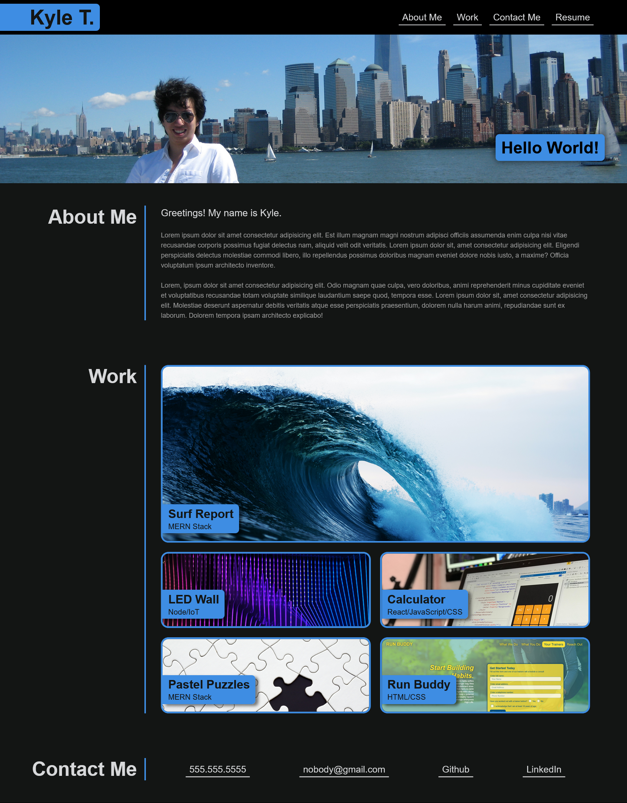

# My-Portfolio

For this week's challenge, I built a personalized portfoilo website using my knowledge of flexbox, mediaqueries, and CSS variables. Most of the projects and links are placeholders except for the Run Buddy project.

## The following image depicts a screenshot of the completed portfolio:

## The following links are for the git repository hosting the code and the portfolio:

* [Link to GitHub repository](https://github.com/kt946/my-portfolio)

* [Link to GitHub deployed application](https://kt946.github.io/my-portfolio/)