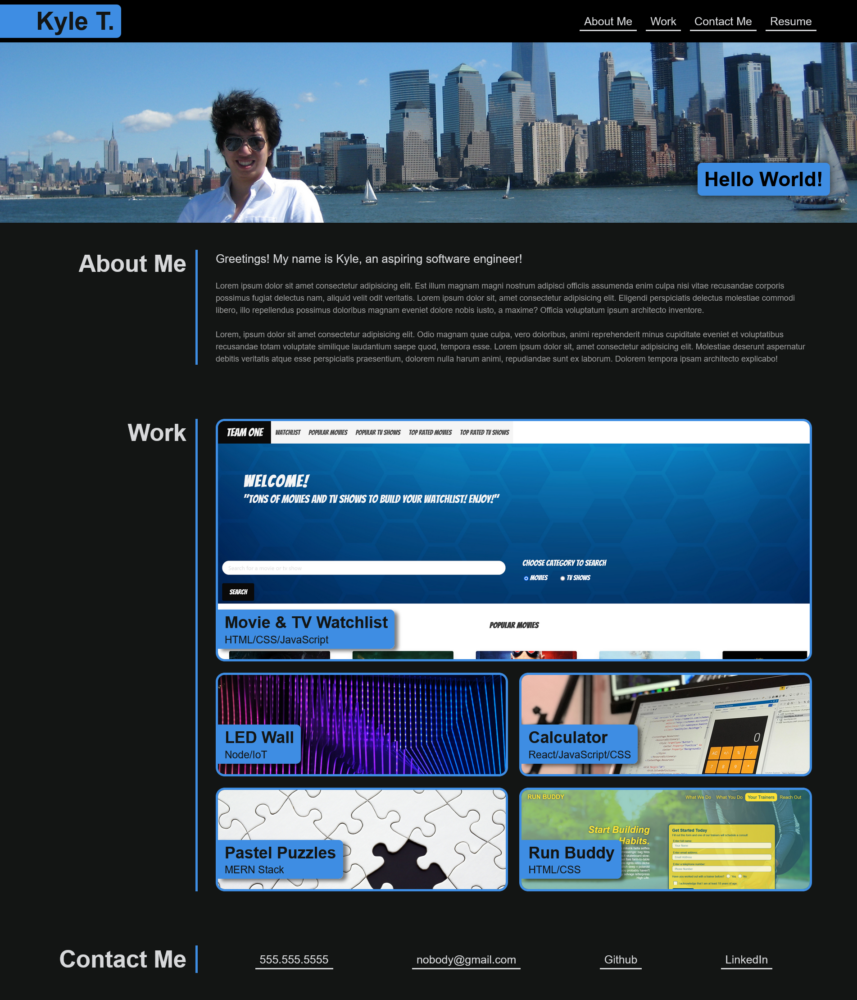

# My-Portfolio

For this week's challenge, I built a personalized portfoilo website using my knowledge of HTML, CSS, flexbox, and media queries. Most of the projects and links are placeholders except for the group project "Movie & TV Watchlist" and the "Run Buddy" project.

## Screenshot of the completed portfolio:

## Links to GitHub repository and application:

* [Link to GitHub repository](https://github.com/kt946/my-portfolio)

* [Link to GitHub deployed application](https://kt946.github.io/my-portfolio/)